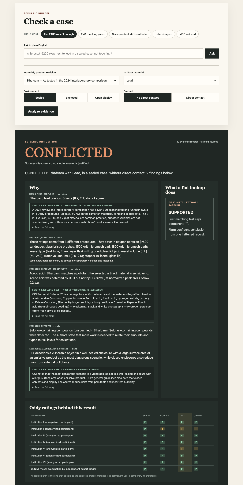

# ArtifactGuard

An agent that tells you what the evidence actually supports for a museum material, instead of whether a test once said "PASS".

Built for the 2026 DEV / Sanity Challenge, Path One. Sanity Context MCP supplies the evidence; explicit rules decide.

**Live demo:** https://artifactguard.onrender.com (no login; the first visit after a long idle can take a minute)

**Dataset:** Sanity project `3yfxc6mg`, dataset `production` (public)



## In plain words

- **The problem:** things in a museum display case can slowly hurt the objects next to them. Glue, foam and paint can give off fumes that corrode metal or leave deposits.
- **The test:** labs check materials with the Oddy test. They seal metal strips with the material for 28 days and see if the metal corrodes. A "pass" sounds final, but it only covers the one sample, lab and setup that was tested.
- **This tool:** you pick a material, an object and how it will be displayed. It looks up the published test results and tells you what they really cover and what they do not. Every answer links to its sources.
- **What it never does:** it never says "safe" and never gives a percentage. It only knows what a few published papers report. It is a thinking aid and does not replace a conservator.

In more detail:

Museums put glue, foam, paint and plastic in display cases next to objects. Some of these materials give off fumes that corrode metal or leave deposits. Conservators screen them with the Oddy test, which seals metal strips with a material for 28 days and rates the corrosion. A pass is reported as if it were a property of the material, but it only covers the batch, laboratory and setup that were tested. ArtifactGuard shows what the published evidence supports for the material, object and display you pick, where sources disagree, and what the sources do not say.

## The problem

Conservators screen display materials with the Oddy test. A structural adhesive, reported in a 2025 review as Terostat-9220, passed it. The compound TMP-ol that the adhesive emits was later linked to white crystalline deposits on objects in display cases at several institutions. The test result was correct. It just didn't cover that case.

The sources also disagree on the product name: the Smithsonian study that identified TMP-ol names Terostat MS 937. ArtifactGuard records that disagreement instead of picking a side.

A test result is evidence with a scope: product revision, protocol, institution, coupon metal, artifact material, contact, enclosure. Searching for `Terostat-9220 → PASS` throws that scope away.

The same pattern shows up across published Oddy data. In a 2024 interlaboratory study, seven institutions tested the same ten materials with their own procedures and rated several of them differently. In a 2022 study of 60 commercial cellulose ethers, Klucel G purchased in 2017 passed on every coupon while samples purchased in 2021 from two suppliers corroded lead.

## What it does

You pick a material, an artifact material and a display setup, or type a question like "Is Terostat-9220 okay next to lead in a sealed case, not touching?". ArtifactGuard follows the links between records and returns one of six dispositions, each with the deductions, the Oddy ratings behind it and the sources:

| Disposition | Meaning |
|---|---|
| `SUPPORTED` | The scoped evidence shows no conflict. It is not a safety guarantee. |
| `CONDITIONAL` | Usable only under the conditions the evidence states. |
| `CONFLICTED` | Sources disagree. |
| `INSUFFICIENT` | Not enough scoped evidence, including unknown or missing inputs. |
| `RETEST` | The evidence is old. Retest before relying on it. |
| `AVOID` | The evidence shows a problem. |

There are no probabilities or safety scores. There is no language model anywhere: questions are matched against the catalog by keyword, and anything missing or ambiguous comes back as a question, not a guess. The verdict is reproducible. One rule depends on the clock: old test results are flagged for review.

When the selected artifact is lead, copper or silver, the rules read that coupon's ratings from every test, not just the blended overall rating. When ratings come from different procedures, the result lists what differs, such as coupon abrasion, vessel type and volume.

It also includes an enclosure calculator for the simplified CCI relation `C = E × A / (V × N)`. It estimates a concentration and sets no safety threshold.

## How it uses Sanity

| Piece | Role |
|---|---|
| Dataset: 10 document types, 363 documents, 848 native references | The evidence graph: product → revision → test → protocol, revision → emission → compound → interaction → artifact material. 141 of the 144 Oddy tests are real published ratings. |
| Context MCP endpoint, GROQ mode | The agent calls `groq_query` and projects the references into the shape the rules use. |
| Knowledge Base, 8 entries | Guidance that doesn't fit a schema: what an Oddy test covers, lab variation, enclosures, wording. |
| Context MCP endpoint, Knowledge Base mode | The agent searches the entries for each topic its deductions raise (`knowledge_base_search`), then reads the top hit (`knowledge_base_read`). |

Each cited entry appears as an excerpt under the deduction that triggered it, and every analysis shows a trace of the Sanity calls the agent made. Knowledge Base text explains a verdict. It cannot change it.

## Run it

Needs Node 22.12 or newer. The app has no runtime dependencies.

```bash
cp .env.example .env
npm start            # http://localhost:3000, local mode
```

Local mode uses a bundled fixture dataset, so you can try it without a Sanity account. To run against real Sanity Context, follow [docs/SANITY_SETUP.md](docs/SANITY_SETUP.md), then:

```bash
ARTIFACTGUARD_MODE=live npm start
```

Deep links to the demo cases: `/?case=terostat`, `/?case=pvc`, `/?case=paint`.

## Configuration

| Variable | Needed in | Purpose |
|---|---|---|
| `ARTIFACTGUARD_MODE` | always | `local` (default) or `live` |
| `PORT` | optional | Default `3000` |
| `SANITY_GROQ_MCP_URL` | live | Context endpoint for the dataset |
| `SANITY_KB_MCP_URL` | live | Context endpoint for the Knowledge Base |
| `SANITY_ORGANIZATION_TOKEN` | live | Organization token with Context Viewer. Server-side only. |
| `SANITY_PROJECT_ID` | optional | Shown at `/api/meta` |

## Tests

```bash
npm run qa
```

| Step | What it checks |
|---|---|
| `lint:project` | No keys or tokens in the repo |
| `lint:seed` | Every reference in the Sanity seed resolves, and the seed and fixture match what the generators build from their sources (needs `npm install` in `studio/` once) |
| `test` | Engine, Sanity client and Knowledge Base retrieval, plain-English interpreter, input validation, rate limiter, frontend guards, and checks that the extracted tables reproduce the papers' own totals |
| `verify:kb` | Flags sentences in the built Knowledge Base entries that the source files do not support (needs the live endpoint) |
| `benchmark` | 25 distinct scenarios against a first-match keyword baseline |
| `redteam` | Prototype pollution, invented numbers, mislabelled synthetic data |
| `fuzz` | 1,000 random scenarios against the engine's invariants |
| `smoke` | A real HTTP server: security headers, bad input, path traversal, rate limit |

The benchmark baseline is a simple keyword matcher written for this project, not a production RAG system. Expected outcomes were written by the same people who wrote the rules, so the benchmark guards behaviour rather than proving accuracy. Cases are tagged `real-source-derived`, `synthetic-rule` or `policy` in `benchmarks/cases.json`. Results: [docs/QA_REPORT.md](docs/QA_REPORT.md).

## Data

The seed is generated, not typed. `research/extracted/` holds table data taken verbatim from the papers; `data/curated.ndjson` holds the records written from their prose, each with its source. Two commands rebuild everything, and tests fail if the committed files drift:

```bash
npm run build:seed      # data/sanity-seed.ndjson
npm run build:fixture   # data/fixture-dataset.json
```

After deploying, check a live URL against every benchmark scenario:

```bash
BASE_URL=https://your-app.example npm run check:deployed
```

## Layout

```text
src/engine/      the rules: analysis, baseline, enclosure calculator
src/infra/       Sanity Context MCP client, live and local repositories
src/agent/       orchestration: dataset, rules, Knowledge Base guidance, plain-English interpreter
src/lib/         HTTP helpers, input validation, rate limiter, call tracing
src/server.mjs   HTTP server and static files
public/          the UI (no framework, no build step)
studio/          Sanity Studio schema
data/            Sanity seed (NDJSON) and the local fixture
knowledge-base/  source files for the Knowledge Base
benchmarks/      the 25 benchmark scenarios
research/        source ledger; research/extracted holds the verbatim table data the seed is built from
docs/            architecture, deployment, setup, threat model, QA
```

## Limits

- Not a certification tool. It does not replace a conservator, manufacturer data or testing.
- The dataset covers what seven published sources report: 10 display-case materials rated in the 2024 interlaboratory study and again in a 2025 study, 60 cellulose ether products and batches, Terostat, and flexible PVC. It is far from a full materials database. Two products are synthetic test fixtures and are labelled as such. Sources are listed in [research/sources.md](research/sources.md), including inconsistencies found inside them.
- Facts the sources do not state are left out. For example, the Terostat Oddy test has no date and no per-coupon results because the papers give none.
- Direct contact with a material that a cited source lists as damaging resolves to `AVOID`. That is ArtifactGuard policy, not a statement by the sources.
- The rate limiter and Knowledge Base cache live in memory, so they assume a single server process.

## Documentation

[Architecture](docs/ARCHITECTURE.md) · [Sanity setup](docs/SANITY_SETUP.md) · [Deployment](docs/DEPLOYMENT.md) · [Threat model](docs/THREAT_MODEL.md) · [QA report](docs/QA_REPORT.md)

## License

MIT. See [LICENSE](LICENSE).
